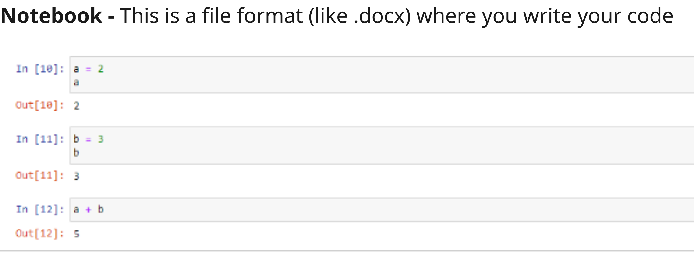
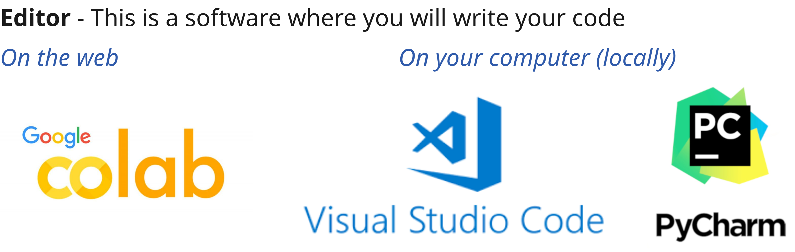
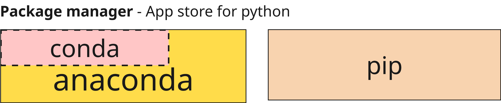
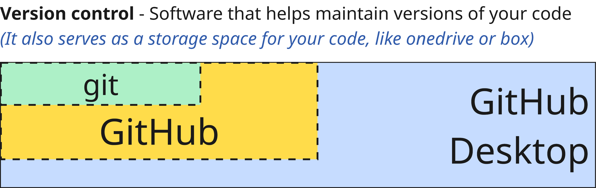
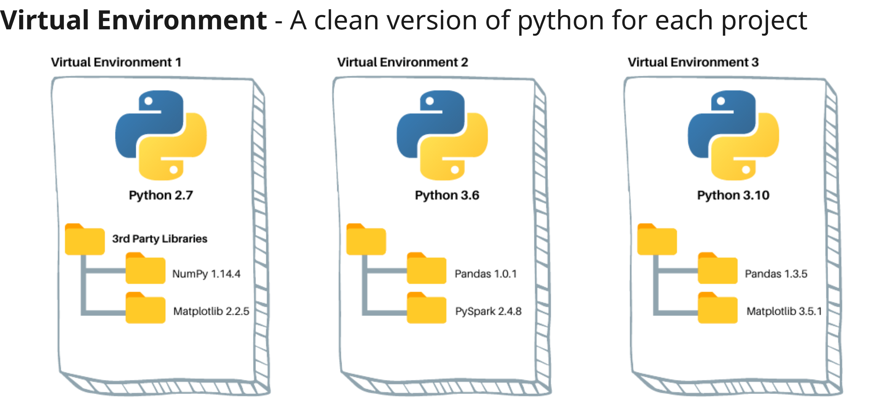

# Getting Started with Python

Welcome to the Python course book! This guide will help you get started with Python, understand its background, and explore the different ways you can use it for your projects.

---

## What is Python?

Python is a high-level, interpreted programming language known for its simplicity and readability. It was created by Guido van Rossum and first released in 1991. Python emphasizes code readability and allows programmers to express concepts in fewer lines of code compared to other languages.

---

## A Brief History

- **1991:** Python 0.9.0 released by Guido van Rossum.
- **2000:** Python 2.0 introduced new features like list comprehensions and garbage collection.
- **2008:** Python 3.0 released, focusing on removing redundant constructs and improving consistency.

Python has grown rapidly in popularity due to its versatility, large community, and extensive libraries.

---

## Why is Python Popular?

- **Easy to Learn:** Simple, readable syntax.
- **Versatile:** Used in data science, automation, Spatial analysis, AI, and more.
- **Large Ecosystem:** Thousands of libraries and frameworks.
- **Strong Community:** Extensive documentation and support.

---

## Python Versions

There are two main versions:
- **Python 2.x:** Legacy version, no longer maintained (But software like grasshopper and Rhino still use it).
- **Python 3.x:** Actively developed and recommended for all new projects.

Always use the latest Python 3.x version unless you have a specific reason to use Python 2 (Like grasshopper).

---

## Ways to Use Python

You can run Python code in several ways:
- **Interactive Shell:** Type `python` in your terminal to execute code line by line. (This is the lightest way to do it - not reccomended)
- **Script Files (.py):** Write code in a `.py` file and run it in your terminal with `python filename.py`. (This is how you run python applications - Advanced)
- **Notebooks:** Interactive documents that combine code, text, and visualizations. (This is how most people do it - Beginner friendly)
- **Online Platforms:** Use services like Google Colab to run Python in your browser. (Ideal for first time users)

---

# Tools for python development
---

## Notebook

---
## What is a Notebook?

A **notebook** (like Jupyter or Google Colab) is an interactive document that allows you to mix code, text, images, and visualizations. Notebooks are ideal for:
- Experimenting with code
- Documenting your workflow
- Sharing results with others

---

### Notebook vs. .py File

| Feature         | Notebook (.ipynb)         | Python Script (.py)      |
|-----------------|--------------------------|--------------------------|
| Interactivity   | High (run cells)         | Low (run whole file)     |
| Documentation   | Supports rich text/markdown | Comments only           |
| Visualization   | Inline display           | Separate window/output   |
| Use Case        | Data analysis, teaching  | Application development  |

---
## Editor (IDEs)

---

## IDEs

- **IDE (Integrated Development Environment):** A software application (basically a text editor) that provides tools for writing, testing, and debugging code. Popular Python IDEs include VS Code, and pycharm. We will use VSCode for this workshop

---
## Package Manager

---
## Version Control

---
## Virtual Environment

---

## Running Python Online

- **Google Colab:** Free, cloud-based notebook environment. No installation required.

